# CAMBIOS MEXILUX

## 1 - Búsqueda MEXILUX (Navegador)

- **Cambiar descripción:**
  - **Título:** Mexilux | Lentes de Diseñador: Estilo y Esencia Mexicana
  - **Descripción:** El plus para tu estilo. ¿Godín, Patrón o Alucín? Tenemos el armazón que define tu modo. Personaliza tus lentes con tintes para la chamba o la playa. Explora "Viendo México" y dale una mirada clara a nuestras raíces. Lo hecho en México, bien hecho.
- **Poner Logo**

---

## 2 - Quiz de página (actualizar igual que página principal)

- Hacer que en lugar de que se descargue la imagen en el cel, se pueda picarle en compartir, y que pida lanzar Instagram que mande directo a subirlos en instastory.
- Generar imagen automática donde venga: qué personalidad es, la descripción, logo en chico con pregunta hasta abajo y ¿Tú qué eres? (Tanto para la de la página principal de Mexilux como la que está en página parte)
- En el de la página se tiene que seleccionar la opción y darle siguiente → **actualizar a que solo con un toque ya pase automáticamente** y actualizar a lo que tenemos, como resultado final.

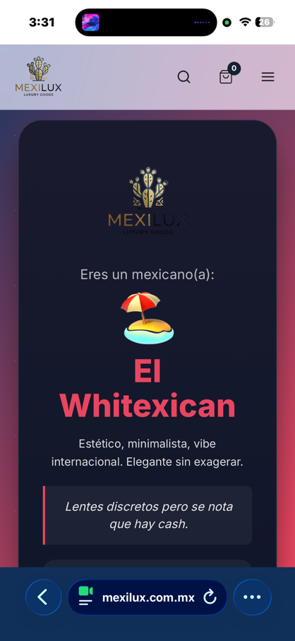
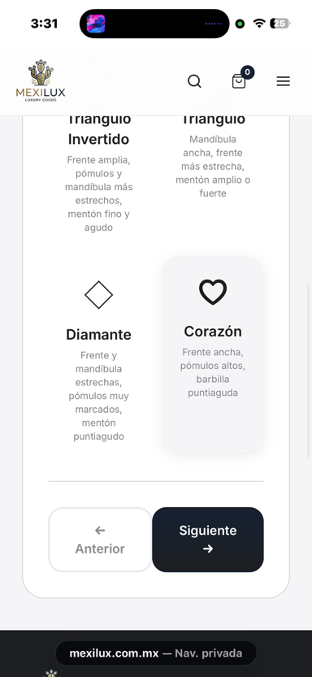

---

## 3 - Emojis

Cambiar los emojis por algo más ameno.

- Solo dejar los de "Página Mexa" y "Ya vamos hay mucho tráfic…"
- Eliminar el de "Pa que no te preocupes"
- En "Página Mexa": el principal → "Lo que está hecho en México está bien hecho", debajo de eso "Página Mexa"

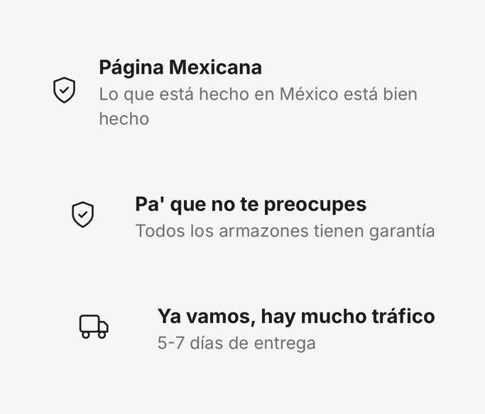

---

## 4 - Etiquetas

Actualizar etiquetas a: **"Hombre"**, **"Mujer"** y la tercera **"Sin etiquetas"**.

---

## 5 - Primera página movible (que cambie automáticamente)

### Primer banner — "Ya te la sabes"

- Botones: **(Hacer quiz)** y **(Nuestra historia)**
  - Estilo de botones similar a Ben & Frank
- Texto descriptivo: _¿O no sabes qué armazón es para ti? ¿Godín, Patrón o Alucín? Tenemos el armazón que define tu estilo._

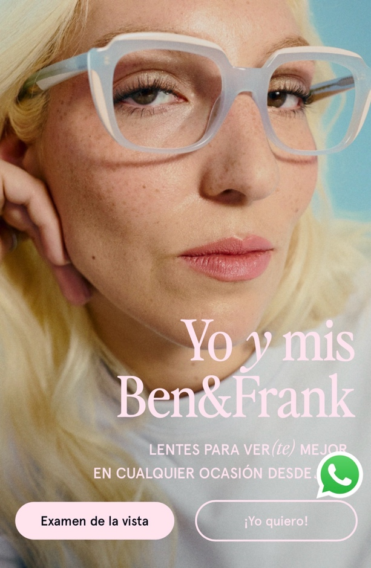

### Segundo banner — "Productos nuevos"

- Botón: **(Ver stock nuevo)**
- Crear deslizamiento automático o con navegación manual entre banners.

### Tercer banner — "El Blog"

- Texto grande: **"Viendo México"**
- Descripción: _Redescubre el país a través de nuestra mirada. Lugares, Cultura, sabor y los mexicanos que están moviendo al mundo._
- Botón: **(Echemosle un ojo)**

> **Nota de botones:** Forma ovalada. En desktop: hover cambia de blanco a gris/negro. En mobile: efecto de presión. Estilo similar a Ben & Frank.

---

## 6 - Orden de la página principal

### Banner movible

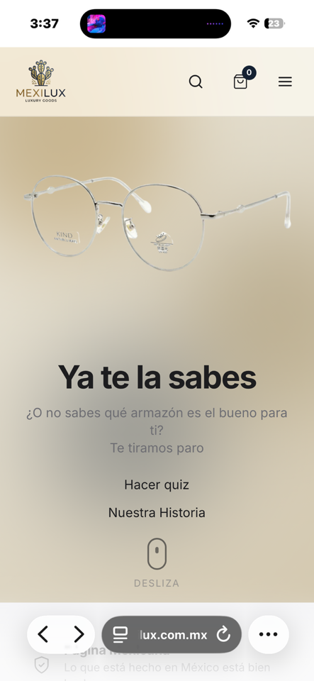

---

### Línea de productos (similar a Ben & Frank)

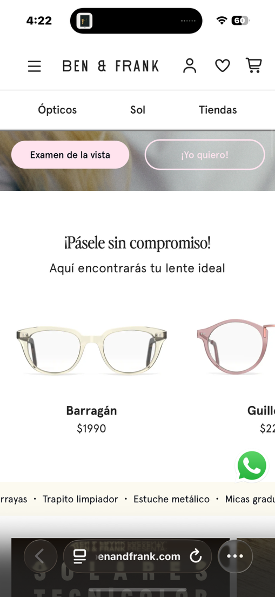

- Se desliza horizontalmente para ver diferentes modelos.
- Texto: **"Pues ya de una no?"**

---

### Categorías

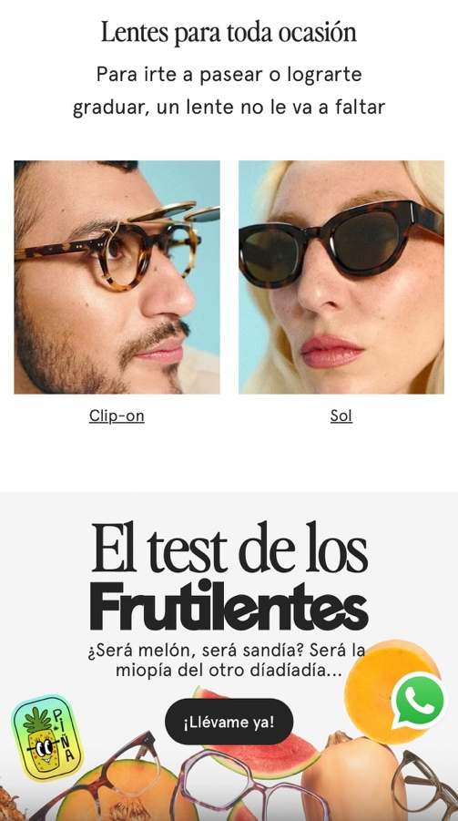
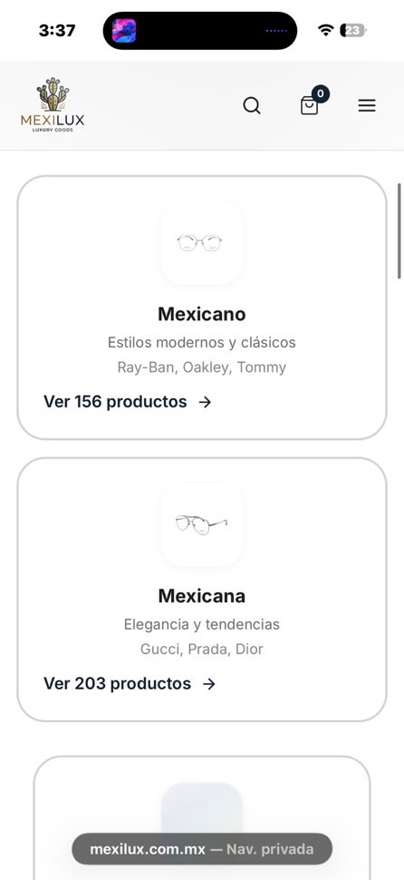

- Conservar los cuadros actuales pero poner dos a la misma altura.
- Formato de texto:
  - **"Mexicano"** y abajo _(Hombre)_ entre paréntesis
  - Misma lógica para los demás
  - El 3ro → **"Sin etiquetas"** completo, no tan chico
- Usar los dibujos que ya tenemos en categorías:

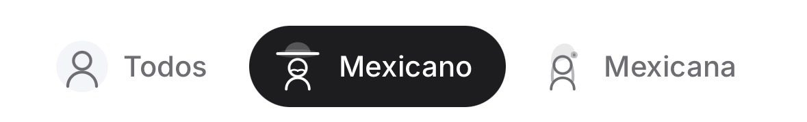

- Actualizar **"Todos"** → **"Sin etiquetas"**
- Orden final: **Mexicano → Mexicana → Sin etiquetas**

---

### Blog

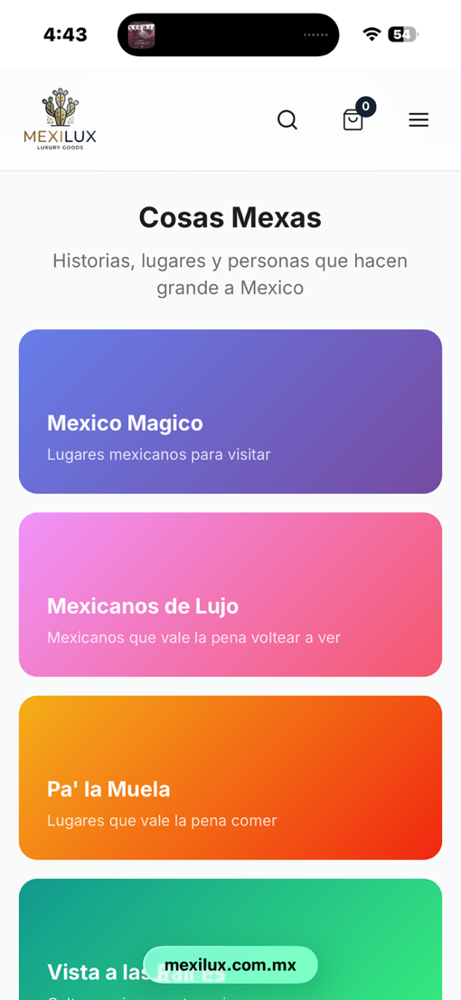

- 4 cuadrículas, 2 a la misma altura (estilo Ben & Frank).
- Cambiar "Cosas Mexas" → **"Viendo México"**
- Descripción: _Redescubre el país a través de nuestra mirada. Lugares, Cultura, sabor y más._

---

### Quiz

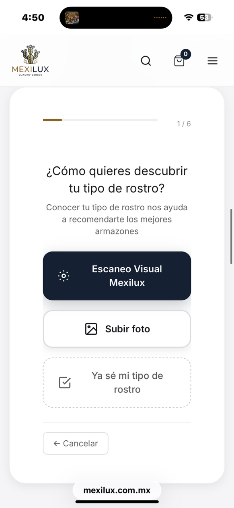

- Cambiar **"¿Ya sabes cuál?"** por texto vacío/nuevo.
- Descripción: _¿Godín, Patrón o Alucín? Tenemos el armazón que define tu modo. Contesta el quiz._
- **Problema de escaneo:** Sigue tardando mucho en abrir la cámara. Mientras carga dice "analizando" en lugar de "cargando". Revisar qué se puede mejorar ahí.

---

### Tratamientos — cambiar nombres

| Nombre actual | Nombre nuevo | Descripción |
|---|---|---|
| Antireflejante | **"Pa la chamba"** | Ideal si pasas hasta 4 hrs frente a dispositivos electrónicos |
| Antiazul (Blueray) | **"La máquina de chambear"** | Ideal si pasas más de 4 hrs frente al computador |
| Polarizado | **"Solazo"** | Ideal para carreteras, playa y flow |
| Tintes | **"Entituneados"** | Tintes a tu manera: estilo parejito (uniforme) y estilo amanecido (degradado) |

> **ENLAZAR con páginas aparte donde se expliquen más a detalle los tratamientos.**

---

### Reseñas

Poner hasta el final.

---

## 7 - Arreglar páginas del blog

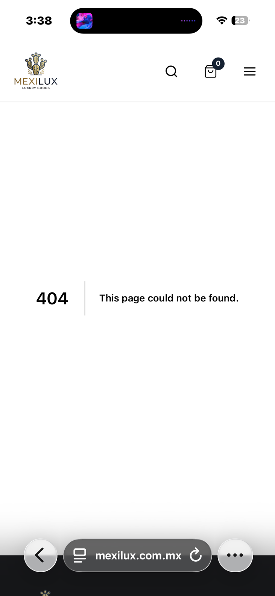

---

## 8 - Asociar redes sociales

Que al tocar los íconos mande tanto a Instagram como a las demás redes sociales.

---

## 9 - Página de producto (donde se muestra el armazón)

### Botón principal

- Reemplazar botones actuales por un único botón: **"Lo compro, quiero el flow mexa"**
- Forma semi-ovalada. Hover: se sombrea. Click: efecto de presión (desktop y mobile).
- Al picar abre una página tipo quiz con 3 preguntas secuenciales:

---

### Paso 1 — ¿Graduación?

1. **"Sin graduación"** — _Para vernos coquetos; recomendado si solo quieres protección para pantallas._
2. **"Con graduación"** — _Soy cegatón; recomendado si tienes miopía, hipermetropía y/o astigmatismo._ _(Costo puede variar según graduación)_

---

### Paso 2 — Tipo de mica

> De cajón todos los lentes traerán antirreflejante. Incluye tratamiento **"Pa la chamba"** (anti reflejo).

| Opción | Descripción | Costo |
|---|---|---|
| **"Pa la chamba"** (Antirreflejo) | Recomendado para los que están frente a pantallas de 0 a 4 hrs/día | **Gratis** |
| **"La máquina de la chamba"** (Antirreflejo azul) | Mayor protección para los que pasan más de 4 hrs frente a pantallas | **+$450** |
| **"El nahual"** (Fotocromático) | Al sol se oscurece casi como lente de sol; de noche o en interiores claro como mica normal | (ver abajo) |
| **"A tu antojo"** (Micas personalizadas) | Entituneados (tintes) o tratamiento "Solazo" (polarizados). También pueden ser graduados. | (ver abajo) |

---

#### Si escoge "Con graduación" → Subir graduación

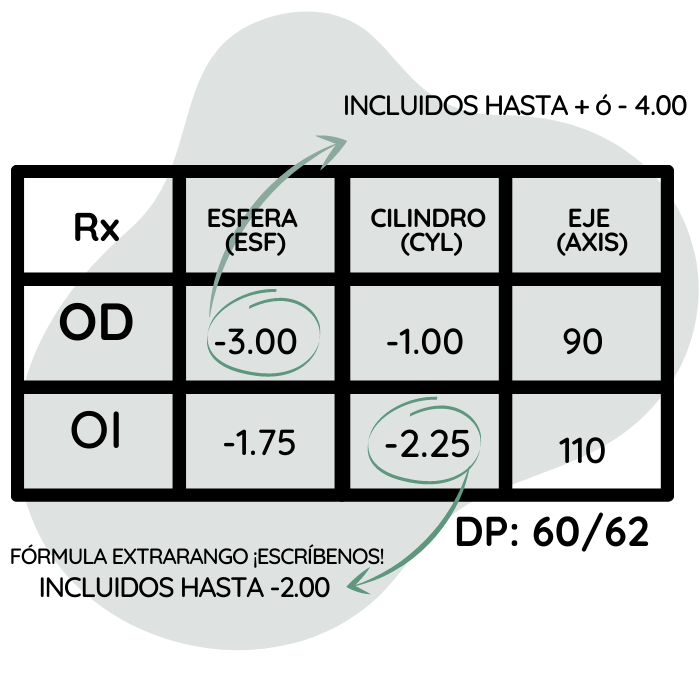

Dos apartados para capturar la graduación (hacerlo visualmente atractivo):

| Rango de graduación (esfera o cilindro) | Costo extra |
|---|---|
| 0 a 2.00 | **Gratis** |
| 2.25 a 4.00 | **+$290** |
| 4.25 a 6.00 | **+$590** |
| Más de 6.00 | Pantalla: solicitar número telefónico → _"En breve se comunicará un asesor para darte cotización personalizada."_ |

> **Regla:** Si cualquier ojo sobrepasa el rango, se cobra la serie donde entra la mayor graduación.

También agregar opción: **"Subir receta"** (subir imagen de la graduación).

---

#### Si escoge "El nahual" (Fotocromático)

**Escoger color:**

| Color | Costo |
|---|---|
| Obsidiana (Negro) | **Gratis** |
| Cenote (Azul) | **+$490** |
| Elote (Amarillo) | **+$490** |
| Ajolote (Rosa) | **+$490** |

Luego escoger tratamiento:

- Sin tratamiento "Pa la chamba"
- Con tratamiento **"Pa la chamba"** (Antirreflejo) — **Gratis**
- Con tratamiento **"La máquina de chambear"** (Antirreflejo Azul) — **+$450**

> Si eligió con graduación, aplican los mismos criterios de graduación pero **solo hasta la 1ª serie**. Si pasa de la primera, va directo al flujo del asesor.

---

#### Si escoge "A tu antojo" (Micas personalizadas)

Dos sub-opciones:

**A) Entituneados (Tintes) — +$350**

1. **Escoger color:**
   - Sangre Azteca (Rojo)
   - Obsidiana (Negro)
   - Cenote (Azul)
   - Cacao (Café)
   - Nopal (Verde)
   - Ajolote (Rosa)
   - Elote (Amarillo)
   - Cempasúchil (Naranja)

2. **Escoger estilo:**
   - Parejito (toda la mica con tinte)
   - Amanecido (tinte desvanecido / degradado)

3. **Escoger nivel de intensidad:** _(ej. "Sangre Azteca I", "Sangre Azteca II", "Sangre Azteca III")_

**B) Solazo (Polarizado) — +$750**

- Escoger color:
  - Obsidiana (Negro)
  - Cacao (Café)

> Si eligió con graduación, aplican los mismos criterios de graduación.

> _Nota: Si se puede poner imagen de cómo se ve la mica al seleccionar cada opción, sería genial._

---

### Referencia visual — estilo Ben & Frank

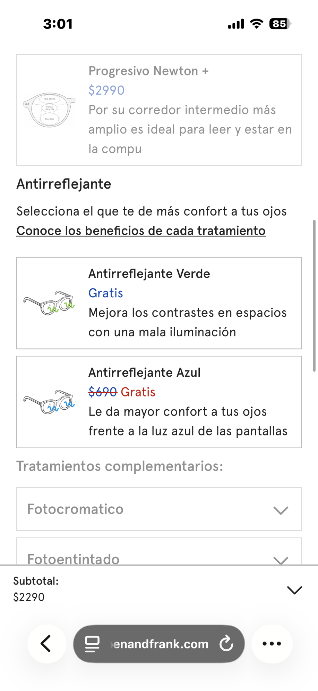

_Queremos algo similar pero con nuestro toque._

---

### Flujo de pago y registro

- Ofrecer opción de continuar como **invitado** o **loguearse**.
- Al registrarse: **descuento de $200 pesos**.
- Si la compra supera **$1,690**: **envío gratis**.

---

## 10 - Zona de cobro

### Problema actual

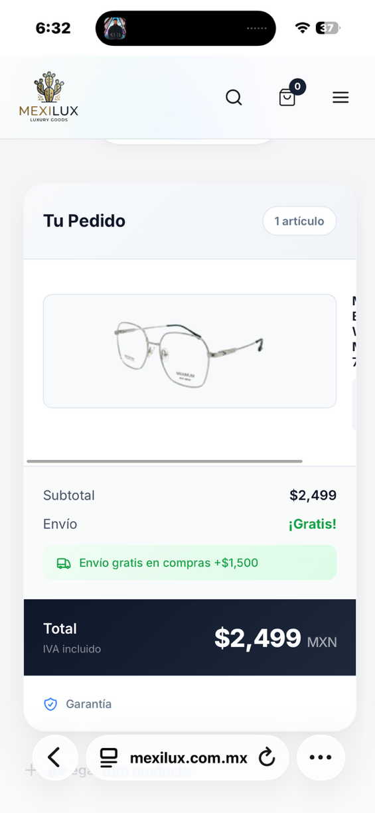

Primera pantalla con resumen. Al dar "Proceder al pago" sale una segunda pantalla igual:

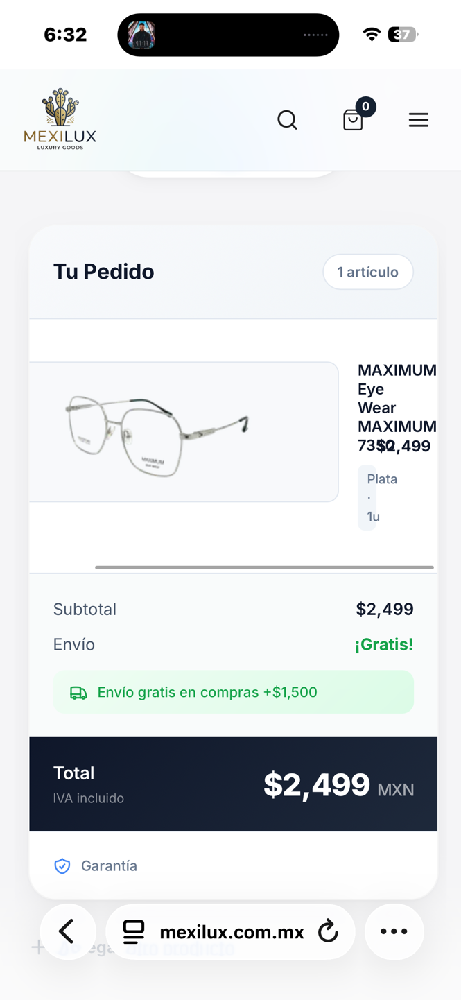

- Mal optimizado, pone trabas, hay que bajar para ver el formulario.
- Si se agrega un tratamiento, **no lo agrega al costo final**.

---

### Solución deseada

Que el resumen de pago:

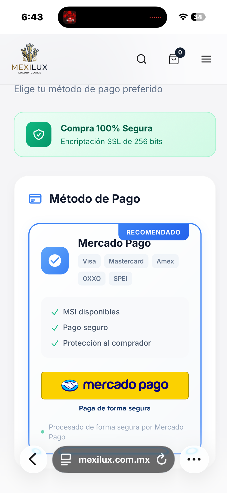

Aparezca ya en la **primera pantalla**.

Al dar "Proceder al pago" → ir directamente a:

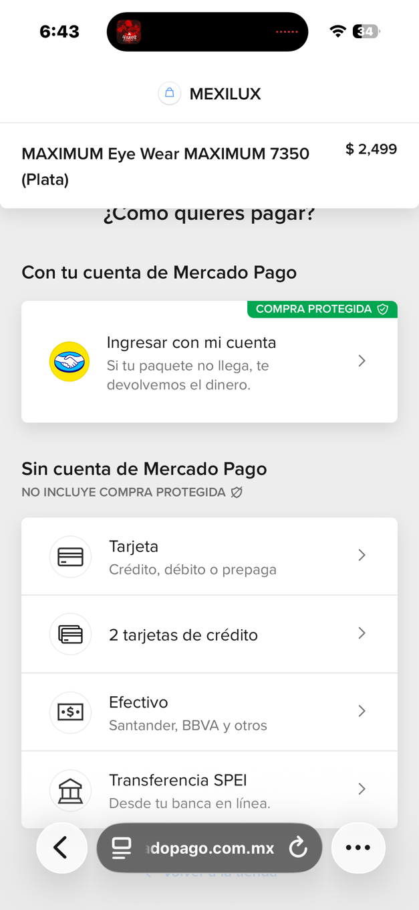

> **Importante:** Que no intente lanzar ninguna aplicación externa. Si quieren loguearse, que el usuario pique en "Ingresa con tu cuenta" manualmente.
